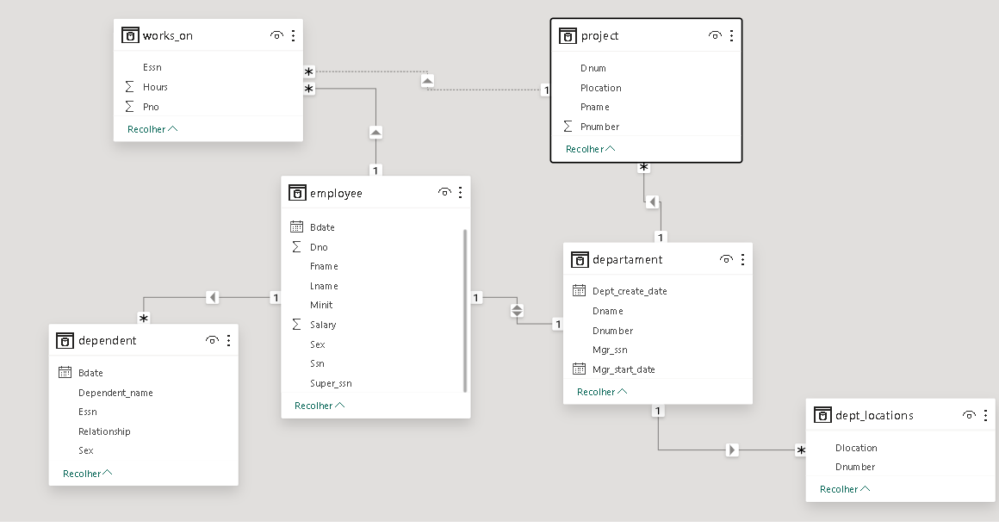
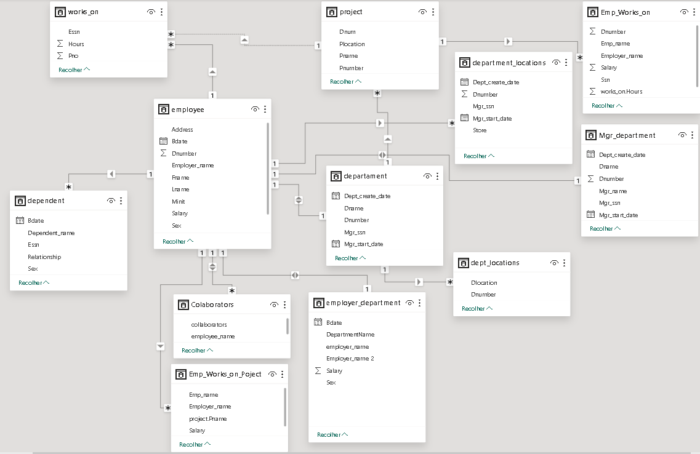
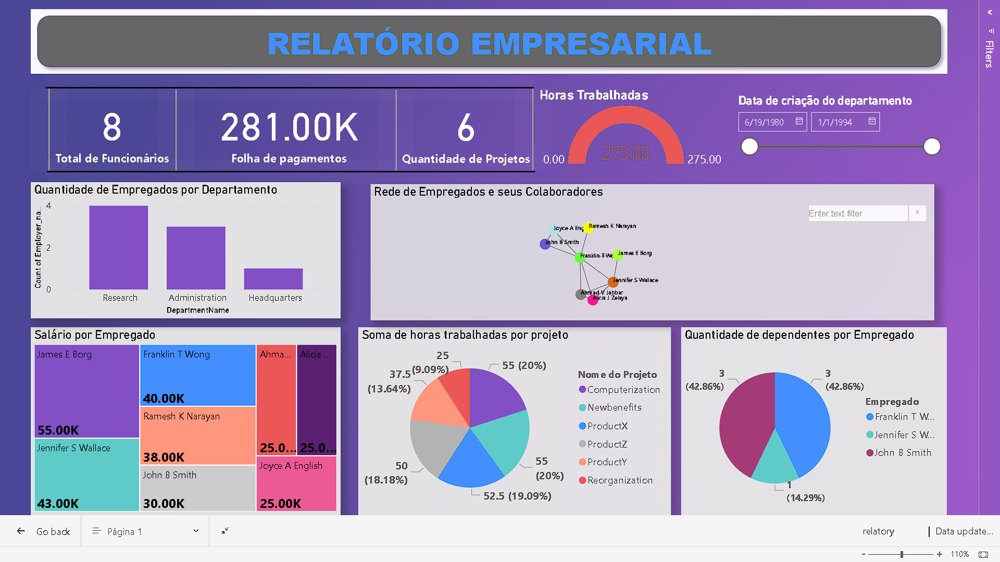
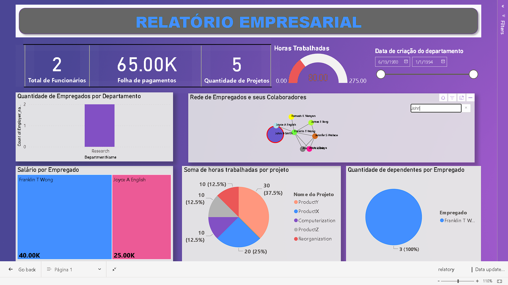
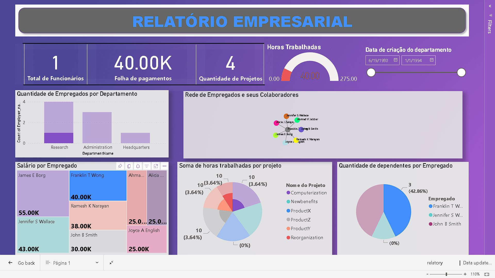

# Introdução

Este projeto foi concebido com o propósito de aplicar os conceitos fundamentais do processo ETL (Extração, Transformação e Carregamento) e criar um relatório para monitorar a precisão e eficácia desse processo. Para alcançar esse objetivo, configuramos uma instância de banco de dados MySQL hospedada na plataforma Azure, onde os dados serão armazenados. Utilizamos o Power BI para criar o relatório e o MySQL Workbench para gerenciar e realizar consultas SQL.

Ao longo deste trabalho, exploramos técnicas de extração de dados de diversas fontes, transformação para adequar os dados ao nosso propósito analítico e carregamento dos dados em um formato adequado para a criação de insights por meio do Power BI.

A combinação dessas ferramentas e técnicas nos permite realizar uma análise abrangente dos dados, identificar tendências, anomalias e padrões que são cruciais para tomadas de decisão informadas no contexto de ciência de dados.

A seguir o Modelo do Banco anterior a fase de ETL:



# ETL

### Abaixo será listado decisões tomadas durante o processo de ETL:
**Nota: Todo o processo de ETL foi realizado pelo Power BI.**

* Renomeação de colunas para melhor entendimento(ex: Dno -> Dnumber)

* Junção entre as tabelas de Empregado e Departamento

* Renomeaçao de diversas colunas como departament.Dname -> DepartmentName, departament.Dept_create_date -> Departament_create_date

* Juncao entre a tabela de empregado para encontrar quais os gerentes de cada empregado. 

* Mescla dos nomes dos empregados(first,mid,last) e de seus respectivos gerentes(firts,mid,last).

* Combinação das tabelas de departamento e suas respectivas localizações, tornando-as unicas.

* Consulta SQL para identificar os colaboradores de cada funcionario(quais funcionario trabalham no mesmo projeto).
    ```SQL
    SELECT DISTINCT
    CONCAT(e1.Fname, ' ', e1.Minit, ' ', e1.Lname) AS employee_name,
        CONCAT(e2.Fname, ' ', e2.Minit, ' ', e2.Lname) AS  collaborators
    FROM 
        azure_company.employee e1
    INNER JOIN 
        azure_company.works_on w1 ON e1.Ssn = w1.Essn
    INNER JOIN 
        azure_company.works_on w2 ON w1.Pno = w2.Pno
    INNER JOIN 
        azure_company.employee e2 ON w2.Essn = e2.Ssn AND e1.Ssn != e2.Ssn
    ORDER BY employee_name DESC;
    ```
* Juncao entre as tabelas Department e Employer para identificar quais os gerentes de cada Departamento

* Junção entre as tabelas Employer, works_on e Project para identificar quais funcionarios atual em quais projetos

A seguir o Modelo do Banco posterior a fase de ETL:



# Relatório

Após a fase de ETL foi feito um relatório simplificado para checagem da corretude dos dados.

* O relatório consiste em um dashboard interativo para acompanhamento dos dados fornecidos pela empresa, abaixo será apresentado a visão geral do relatório e algumas interações possíveis.



* O relatorio possio uma rede de network onde é posssivel filtrar quais funcionarios trabalham em um mesmo projeto e a partir da escolha de um funcionario especifico é possivel analisar os dados presentes nos outros gráficos, por exemplo, na imagem abaixo podemos ver que o funcionario John esta trabalhando com os funcionários Franklin e Joyce no Departamento de Pesquisa em 5 projetos distintos, podemos ver ainda as horas que eles gastaram trabalhando em cada projeto, além de realizar várias outras análises com as informações presentes.




* Abaixo, outra visualização a partir de interações com o relatório.



# Conclusão

Ao longo deste projeto, aplicamos os princípios fundamentais do processo de ETL (Extração, Transformação e Carregamento) para preparar e analisar os dados fornecidos. Utilizamos uma combinação de ferramentas, para extrair dados de diversas fontes, transformá-los em um formato adequado e carregá-los em um ambiente onde possamos realizar análises mais detalhadas.

Durante a fase de ETL, tomamos uma série de decisões para limpar e preparar os dados, como renomear colunas, unir tabelas e criar consultas SQL para identificar relacionamentos entre os funcionários e os projetos em que estão envolvidos. Essas etapas foram essenciais para garantir a qualidade e integridade dos dados antes de serem utilizados na criação do relatório.

No relatório final, apresentamos uma visão geral dos dados por meio de um dashboard interativo no Power BI. O dashboard incluiu uma variedade de visualizações, como gráficos de rede, gráficos de barras e de pizza, que nos permitiram analisar os relacionamentos entre os funcionários, os projetos em que estão envolvidos e outras métricas importantes, como horas trabalhadas.

Por meio das interações com o dashboard, pudemos identificar padrões, tendências e insights valiosos que podem ser usados para tomar decisões informadas no contexto da empresa.

Em resumo, este projeto demonstra o poder e a importância do processo de ETL e do uso de ferramentas como o Power BI para transformar dados brutos em insights acionáveis que podem impulsionar o sucesso e a tomada de decisões informadas em uma organização.